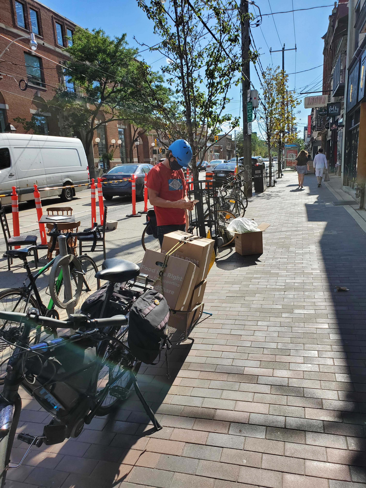
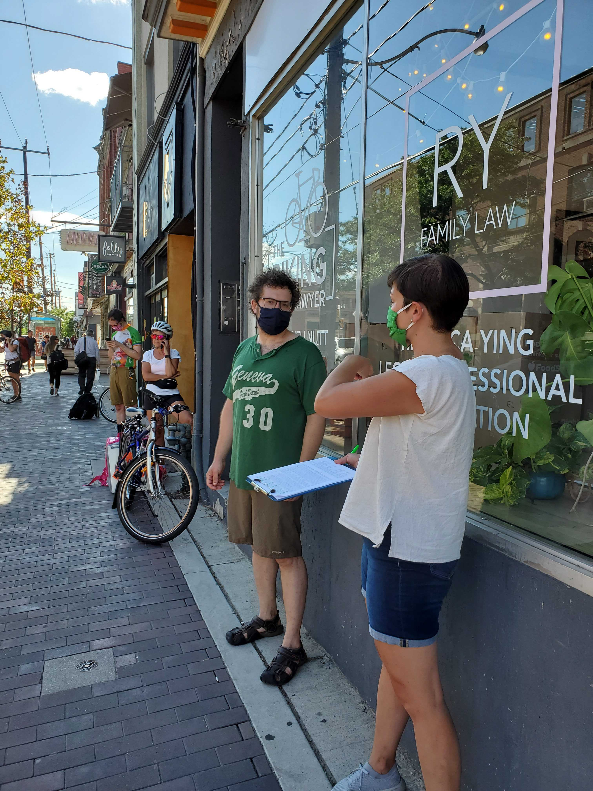
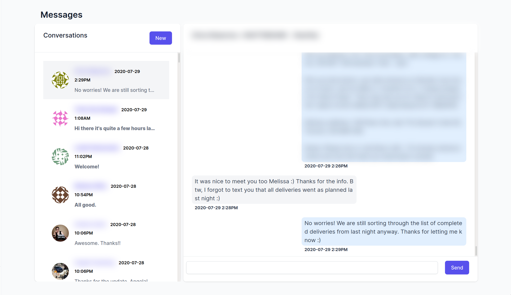

# Real World LiveView
## How to deliver 2500lb* of vegetables a week without writing any* JavaScript

---

# Who am I?
- Currently on leave from GitHub
- Spent the summer doing [Recurse Center](https://www.recurse.com/)
- Built out the technology powering the [Toronto Bike Brigade](https://www.bikebrigade.ca/)

---


---


---


---



---


---


--- 


---



---


---

# How it works

- FoodShare gives us a spreadsheet of deliveries
- Riders sign up to do a delivery (currently via Google Form)
- Riders are matched with deliveries (based on address and capacity)
- Riders receive a text message with delivery details (Twilio)
- Dispatchers communicate with riders via text

---



---

# LiveView

- Powers almost everything
- I'll discuss my experiences, bugs I ran into, and future work
- Let's focus on authentication and the messaging


# Anatomy of a LiveView

```elixir
defmodule BikeBrigadeWeb.LoginLive do
  use BikeBrigadeWeb, :live_view
  
  def mount(_params, _session, socket) do
    {:ok, assign(socket, ...)}
  end

  def handle_params(_params, _uri, socket) do
    {:noreply, assign(socket, ...)}
  end

  def handle_event("event_name", _params, socket) do
    {:noreply, assign(socket, ...)}
  end
end
```

---

# The Template

- `live_view_name.leex.html`

or

```elixir
def render(assigns) do
  ~L'''
  <div>
    <%= @some_variable %>
  </div>
  '''
end
```

---
# The counter example

```elixir
defmodule MyCounter do
  use Phoenix.LiveView
  def render(assigns) do
    ~L"""
    <button phx-click="inc_counter">Increment counter</button>
    <h1 id="counter"><%= @counter %></h1>
    """
  end
  def mount(_params, _session, socket) do
    {:ok, assign(socket, :counter, 0)}
  end
  def handle_event("inc_counter", _, socket) do
    {:noreply, assign(socket, :counter, socket.assigns.counter + 1)}
  end
end
```

---
# Quick Demo
---
## Mount

```json
{
  "0": "0",
  "s": [
    "<button phx-click=\"inc_counter\">Increment counter</button>\n<div id=\"counter\">",
    "</div>\n"
  ]
}
```

## Increment Counter

```
{
  "0": "1"
}
```
---

# Rendering a List
```erb
    <button phx-click="add_item">Add Item to List</button>
    <div id="container">
      <%= for item <- @list do %>
      <div id="<%= item %>"><%= item %></div>
      <% end %>
    </div>
```
--- 
```elixir
  def mount(_params, _session, socket) do
    {:ok,
     socket
     |> assign(:list, [])
     |> assign(:next_index, 0)}
  end

  def handle_event("add_item", _, socket) do
    i = socket.assigns.next_index

    {:noreply,
     socket
     |> assign(:list, socket.assigns.list ++ [i])
     |> assign(:next_index, i + 1)}
  end
end
```

---
# (Quick Demo) How it works

## Mount
```json
{
  "0": "",
  "s": [
    "<button phx-click=\"add_item\">Add Item to List</button>\n<div id=\"container\">\n  ",
    "\n</div>\n"
  ]
}
```

--- 

## Click once
```json
{
  "0": {
    "d": [
      [
        "0",
        "0"
      ]
    ],
    "s": [
      "\n  <div id=\"",
      "\">",
      "</div>\n  "
    ]
  }
}
```
---

## Click again

```json
{
  "0": {
    "d": [
      [
        "0",
        "0"
      ],
      [
        "1",
        "1"
      ]
    ]
  }
}
```

---

## Click again

```json
{
  "0": {
    "d": [
      [
        "0",
        "0"
      ],
      [
        "1",
        "1"
      ],
      [
        "2",
        "2"
      ]
    ]
  }
}
```

---

# We're sending too much data!  

```erb
<button phx-click="add_item">Add Item to List</button>
<div id="container" phx-update="append">
    <%= for item <- @list do %>
    <div id="<%= item %>"><%= item %></div>
    <% end %>
</div>
```
---

```elixir
  def mount(_params, _session, socket) do
    {:ok,
     socket
     |> assign(:list, [])
     |> assign(:next_index, 0),
    temporary_assigns: [list: []]}
  end

  def handle_event("add_item", _, socket) do
    i = socket.assigns.next_index

    {:noreply,
     socket
     |> assign(:list, [i])
     |> assign(:next_index, i + 1)}
  end
```

---

# (Quick Demo) How it works

## Mount

```json
{
  "0": "",
  "s": [
    "<button phx-click=\"add_item\">Add Item to List</button>\n<div id=\"container\" phx-update=\"append\">\n  ",
    "\n</div>\n"
  ]
}
```

---

## Click once

```json
{
  "d": [
    [
      "0",
      "0"
    ]
  ],
  "s": [
    "\n  <div id=\"",
    "\">",
    "</div>\n  "
  ]
}
```

---

## Click again

```json
{
  "0": {
    "d
    ": [
      [
        "1",
        "1"
      ]
    ]
  }
}
```
---

## Click again

```json
{
  "0": {
    "d": [
      [
        "2",
        "2"
      ]
    ]
  }
}
```
---

# Messaging

- You now know enough to build a live messaging app (just add Twilio!)
- This is the "Blog in 15 minutes" of Elixir/Phoenix/LiveView
---

# Phoenix ships with LiveView generators

```bash
mix phx.gen.live \\
  Messaging SmsMessage sms_messages \\
  from:string to:string body:string sent_at:datetime twilio_sid:string
```
---

```
* creating lib/bike_brigade_web/live/sms_message_live/show.ex
* creating lib/bike_brigade_web/live/sms_message_live/index.ex
* creating lib/bike_brigade_web/live/sms_message_live/form_component.ex
* creating lib/bike_brigade_web/live/sms_message_live/form_component.html.leex
* creating lib/bike_brigade_web/live/sms_message_live/index.html.leex
* creating lib/bike_brigade_web/live/sms_message_live/show.html.leex
* creating test/bike_brigade_web/live/sms_message_live_test.exs
* creating lib/bike_brigade_web/live/modal_component.ex
* creating lib/bike_brigade_web/live/live_helpers.ex
* creating lib/bike_brigade/messaging/sms_message.ex
* creating priv/repo/migrations/20200730190623_create_sms_messages.exs
* creating lib/bike_brigade/messaging.ex
* injecting lib/bike_brigade/messaging.ex
* creating test/bike_brigade/messaging_test.exs
* injecting test/bike_brigade/messaging_test.exs
* injecting lib/bike_brigade_web.ex

Add the live routes to your browser scope in lib/bike_brigade_web/router.ex:

    live "/sms_messages", SmsMessageLive.Index, :index
    live "/sms_messages/new", SmsMessageLive.Index, :new
    live "/sms_messages/:id/edit", SmsMessageLive.Index, :edit

    live "/sms_messages/:id", SmsMessageLive.Show, :show
    live "/sms_messages/:id/show/edit", SmsMessageLive.Show, :edit


Remember to update your repository by running migrations:

    $ mix ecto.migrate

```
---
# Context

```elixir
  @doc """
  Returns pairs of riders and the last message, sorted by last message sent
  """
  def list_sms_conversations do
    q =
      from m in SmsMessage,
        join: r in Rider,
        on: r.phone == m.to or r.phone == m.from,
        select: %{m | row_number: over(row_number(), order_by: [desc: m.sent_at], partition_by: r.id)}

    query =
      from m in subquery(q),
        join: r in Rider,
        on: r.phone == m.to or r.phone == m.from,
        order_by: [desc: m.sent_at],
        where: m.row_number == 1,
        select: {r, m}


    Repo.all(query)
  end
```
---

```elixir
  @doc """
  Returns all the messages for a rider
  """
  def get_sms_conversation(%Rider{} = rider) do
    query =
      from m in SmsMessage,
        join: r in Rider,
        on: r.phone == m.to or r.phone == m.from,
        where: r.id == ^rider.id,
        order_by: [asc: m.sent_at]

    Repo.all(query)
  end
  ```
---

# LiveView

```elixir
  def mount(_params, session, socket) do
    conversations = Messaging.list_sms_conversations()

    {:ok, socket
    |> assign(:conversations, conversations),
    # conversation will be assigned later
    temporary_assigns: [current_conversation: []]}
  end
```
---

```elixir
  def handle_params(params, url, socket) do
    {:noreply, socket |> apply_action(socket.assigns.live_action, params)}
  end

  defp apply_action(socket, :show, %{"id" => id}) do
    rider = Riders.get_rider!(id)
    assign_conversation(socket, rider)
  end

  defp apply_action(socket, :index, _params) do
    # Assign the first conversation
    {rider, _} = List.first(socket.assigns.conversations)
    assign_conversation(socket, rider)
  end
```
---

```elixir
  defp assign_conversation(socket, rider) do
    conversation = Messaging.get_sms_conversation(rider)
    sms_message = Messaging.new_sms_message(rider.phone)
    changeset = Messaging.send_sms_message_changeset(sms_message)
    todays_tasks = Delivery.todays_tasks(rider)

    socket
    |> assign(:current_conversation, conversation)
    |> assign(:selected_rider, rider)
    |> assign(:sms_message, sms_message)
    |> assign(:sms_message_changeset, changeset)
  end
  ```
---
# Template

```erb
<ul>
<%= for {rider, last_message} <- @conversations  do %>
<li id="conversation-list-item:<%= rider.id %>">
  <%= live_patch to: Routes.sms_message_index_path(@socket, :show, rider.id) do %>
  <span>
    <%= rider.name %>
  </span>
  <span>
    <%= localize_datetime(last_message.sent_at) %>
  </span>
  <span class="truncate">
    <%= last_message.body %>
  </span>
 </li>
<% end %>
</ul>
```
---

# Components!

- Separation of concerns
- Lives inside LiveView process
- Can route events to it with `@myself`
- Handle state inside or outside

```erb
<%= live_component @socket, ConversationComponent, 
    id: @selected_rider.id, 
    selected_rider: @selected_rider, 
    current_conversation: @current_conversation, 
    sms_message_changeset: @sms_message_changeset %>

```

---

```elixir
defmodule BikeBrigadeWeb.SmsMessageLive.ConversationComponent do
  use BikeBrigadeWeb, :live_component
  @impl true
  def render(assigns) do
    ~L"""
    <div id="conversation:<%= @selected_rider.id %>">
    <%= for message <- @current_conversation do %>
        <div id="message:<%= message.id %> 
        class="<%= if message.from == @selected_rider.phone, do: "bg-gray-100", else: "bg-blue-100" %>">
            <span><%= message.body %></span>
        </div>
    <% end %>
    <div id="conversation-form">
    <%= f = form_for @sms_message_changeset, "#",
        phx_submit: "send",
        phx_target: @myself %>
        <%= textarea f, :body, phx_debounce: "blur" %>
        <button type="submit" phx-disable-with="Sending...">Send</button>
    </form>
    """
   end
```
---
```elixir
  def handle_event("send", %{"sms_message" => sms_message_params}, socket) do
    {:noreply, send_sms_message(socket, sms_message_params)}
  end

  defp send_sms_message(socket, params) do
    case Messaging.send_sms_message(socket, params) do
      {:ok, _sms_message} ->
        sms_message = Messaging.new_sms_message(socket.assigns.selected_rider.phone)
        changeset = Messaging.send_sms_message_changeset(socket.assigns.sms_message)
        assign(socket, sms_message_changeset: changeset)

      {:error, %Ecto.Changeset{} = changeset} ->
        assign(socket, :sms_message_changeset, changeset)
    end
  end
end
  ```

  ---

  # But what about new messages you ask?

  - We're not updating the list of messages when we send
  - We're also not able to receive new messages
  - How is this possible?!

  ---

  # Quick Twilio asside

  - We'll get messages as a webhook

  ```elixir
  defmodule BikeBrigadeWeb.WebhookController do
  use BikeBrigadeWeb, :controller  
    def twilio(conn, %{"From" => from_phone, "To" => to_phone, 
                     "Body" => body, "SmsMessageSid" => sid} = msg) do
        {:ok, _msg} = Messaging.create_sms_message(
             %{from: from_phone, to: to_phone, 
              body: body, twillio_sid: sid, 
              sent_at: DateTime.utc_now()})

    # todo tell twilio things bad
    send_resp(conn, :ok, "")
    end
end
```

--- 

# Enter Phoenix.PubSub
- LiveView + PubSub is MAGIC
- PubSub messages are arbitrary tuples, on a topic (named via string)
- Any process can subscribe
- Handle with `handle_info`
- LiveView is a process!

----

```elixir
  # Messaging Context
  def create_sms_message(sms_message \\ %SmsMessage{}, attrs) do
    sms_message
    |> SmsMessage.changeset(attrs)
    |> Repo.insert()
    |> broadcast(:message_created)
  end

  defp broadcast({:error, _reason} = error, _event), do: error

  defp broadcast({:ok, struct}, event) do
    Phoenix.PubSub.broadcast(BikeBrigade.PubSub, "messaging", {event, struct})
    {:ok, struct}
  end
```
---

```elixir
# Messaging Context
def subscribe do
  Phoenix.PubSub.subscribe(BikeBrigade.PubSub, "messaging")
end

# LiveView
def mount(_params, session, socket) do
  if connected?(socket) do
    Messaging.subscribe()
  end
  # ...
```

---

```elixir
def handle_info({:message_created, message}, socket) do
    # Reload the full list of conversations
    conversations = Messaging.list_sms_conversations()

    # Update the page we're on if the message matches
    rider = Messaging.get_rider_for_message(message)
    if rider && rider.id == socket.assigns.selected_rider.id do
      send_update ConversationComponent, selected_rider.id, conversation: [message]
    end

    {:noreply,
     socket
     |> assign(:conversations, conversations)}
  end

```

--- 


# Problems/Future Work

- DOM memory leak with `phx-update="append"`
  - [Fixed!](https://github.com/phoenixframework/phoenix_live_view/pull/1082)
- `phx-update="append"` doesn't have good support for reordering and removal.
  - [Working on it!](https://github.com/phoenixframework/phoenix_live_view/pulls/mveytsman)


---

# Questions?

- [@mveytsman](https://twitter.com/mveytsman)
- [https://max.computer](https://max.computer)
- Slides: 


